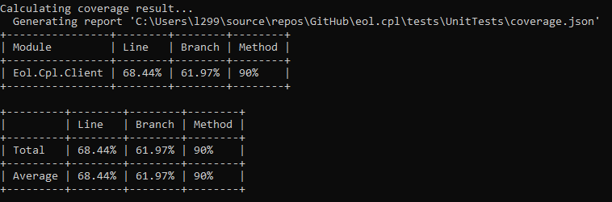

# EOL Cricket Premier T20 League :cricket:
This app is to simulate the 2nd innings of the cricket match, ball by ball.

> ### App Objectives
- Simulate the match ball by ball.
- Shows the ball by ball commentary.
- Shows the match result along with individual score.

> ### App Skeleton
- Console client
- Unit Tests 


### Running the app
App is built targeting .net core 2.2, .net core sdk is pre requisite to run.

1 Launch command prompt

2 Navigate to the Client folder within the solution directory & run the `dotnet run --project Client.csproj` command

Update `matchData.json` file in case if you like to try with different data. File is located in Client project within solution directory.

For example, 
Try updating the ScoreProbabilities for players

```csharp
  "Players": [
    {
      "Id": 1,
      "Name": "Pravin",
      "TeamId": 1,
      "ScoreProbabilities": [ 5, 30, 25, 10, 15, 1, 9, 5 ]
    },    
```
Also try updating match details to change the score card & target. Remember team2 is chasing team.
```csharp
 "Matches": [
    {
      "BatFirstTeamId": 2,
      "Id": 1,
      "Innings": 2,
      "IsOver": false,
      "Team1_Id": 2,
      "Team1_OversPlayed": 20,
      "Team1_Score": 139,
      "Team2_Id": 1,
      "Team2_OversPlayed": 16,
      "Team1_WicketsLeft": 5,
      "Team2_WicketsLeft": 3,
      "Team2_Score": 100
    }
```

### How it works?
#### Preparation
- Reads players data, every player has their own scoring probabilities associated with them.
- Each player score probabilities should match to 100.
- Converts players score probabilities to discrete Cumulative Distribution array.

#### Facing delivery
- For each ball, random number is generated.
- Select the index from the array, if the random is less than or equals to the value.
- Rules of the game is applied based on the index.

Linear search is used as records very minimal.

#### Below is the test coverage report. 



Xml documetation generated for each projects are located in `Properties` folder respectively.  